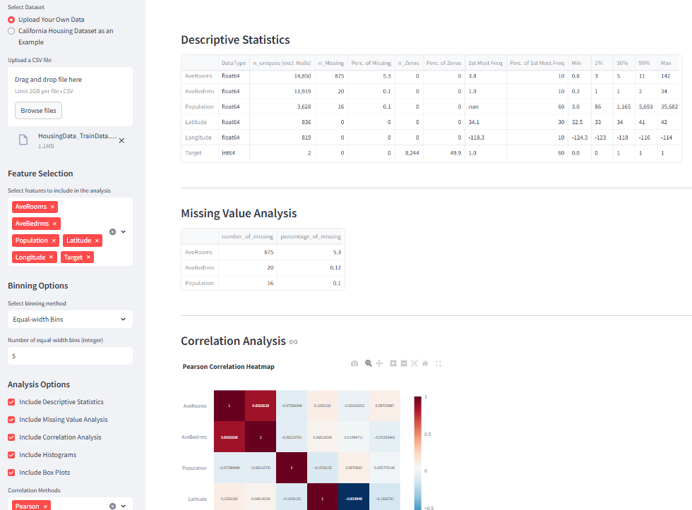

# 📊 Data Profiler Dashboard

Welcome to the **Data Profiler Dashboard**! This Streamlit-based application enables comprehensive data profiling and analysis, making it easy to understand your dataset's structure, quality, and statistics.

Try my EDA app: https://profiledata.streamlit.app/ 



## Features

- **Descriptive Statistics**: Summary statistics for each feature.
- **Missing Value Analysis**: Shows counts and percentages of missing values.
- **Correlation Analysis**: Pearson, Spearman, and Kendall correlation matrices.
- **Histograms**: Visualize data distributions with customizable binning options.
- **Box Plots**: Identify outliers and visualize feature distributions. 

## How to Use

1. **Upload Your Data**: 
   - Use the sidebar to upload your CSV file or load the example California Housing dataset.
2. **Select Features**:
   - Choose specific columns for analysis.
3. **Binning and Analysis Options**:
   - Customize binning methods and the types of analyses to perform.
4. **Run Profiling**:
   - Click **Run Profiling** to start the data analysis process.

## Installation

Clone the repository and navigate to the project directory: 

```bash
git clone https://github.com/parsafarshadfar/eda_webapp.git
cd eda_webapp
``` 

Install the required packages:

```bash
pip install -r requirements.txt
```

## Run the Application 

Launch the Streamlit app with:

```bash
streamlit run app.py
 
or 

python3 -m streamlit run app.py
```

## Requirements

- `streamlit==1.39.0`
- `pandas==2.2.3`
- `numpy==2.1.2`
- `matplotlib==3.9.2` 
- `seaborn==0.13.2`
- `plotly==5.24.1`
- `scipy==1.14.1`
- `openpyxl==3.1.5`


## Usage in Industry 

Data profiling is essential across industries to:
- Detect data quality issues. 
- Understand data distributions.
- Identify outliers and anomalies.
- Inform data-driven decisions.

Explore your data with ease and gain valuable insights with the **Data Profiler Dashboard**!

## Notes on Hardware Configuration and Jupyter Notebook Support
 
Due to low hardware configuration, some features like the **groupby** functionality are not available in this web app. For full functionality, including groupby operations, use the Jupyter Notebook provided in the example directory.

The Jupyter Notebook also supports **Spark SQL DataFrame** and **PySpark Pandas DataFrames**, and it has been successfully tested in Databricks.


**Enjoy analyzing your data!**